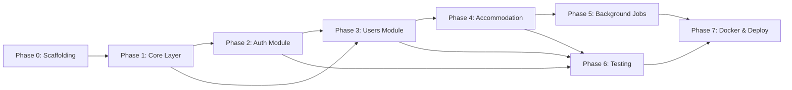
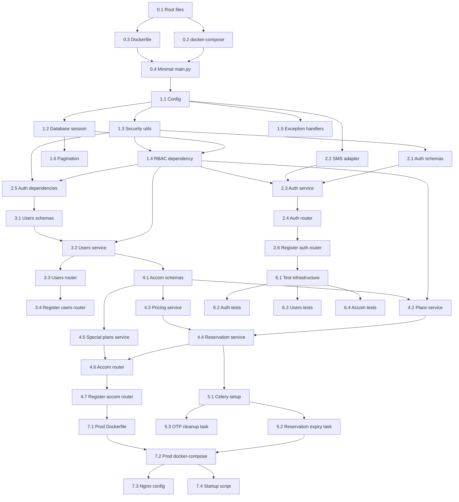

# StaffHub — Backend Implementation Plan

> **Architecture:** Modular Monolith (Option B — Approved)  
> **Stack:** Python 3.11+ / FastAPI / SQLAlchemy 2.x / MySQL 8.x / Redis / Celery  
> **Date:** 2026-02-23

---

## Table of Contents

1. [Development Phases Overview](#1-development-phases-overview)
2. [Phase 0 — Project Scaffolding & Infrastructure](#2-phase-0--project-scaffolding--infrastructure)
3. [Phase 1 — Core Layer](#3-phase-1--core-layer)
4. [Phase 2 — Auth Module](#4-phase-2--auth-module)
5. [Phase 3 — Users Module](#5-phase-3--users-module)
6. [Phase 4 — Accommodation Module](#6-phase-4--accommodation-module)
7. [Phase 5 — Background Jobs](#7-phase-5--background-jobs)
8. [Phase 6 — Testing](#8-phase-6--testing)
9. [Phase 7 — Dockerization & Deployment](#9-phase-7--dockerization--deployment)
10. [Task Dependency Graph](#10-task-dependency-graph)
11. [Estimated Timeline](#11-estimated-timeline)

---

## 1. Development Phases Overview

The build order follows dependency chains: infrastructure first, then core utilities, then modules from least-dependent to most-dependent.



| Phase | What | Depends On | Estimated Effort |
|-------|------|-----------|-----------------|
| 0 | Project scaffolding, deps, Docker dev env | Nothing | 0.5 day |
| 1 | Core layer (DB, security, RBAC, config, exceptions) | Phase 0 | 1–2 days |
| 2 | Auth module (login, OTP, JWT, refresh, logout) | Phase 1 | 2–3 days |
| 3 | Users module (orgs, users, profiles, children, roles) | Phases 1, 2 | 2–3 days |
| 4 | Accommodation module (places, pricing, reservations, discounts, plans) | Phases 1, 2, 3 | 4–5 days |
| 5 | Background jobs (reservation expiry, OTP cleanup) | Phase 4 | 1–2 days |
| 6 | Integration & unit tests | Phases 2, 3, 4 | 2–3 days (parallel with each phase) |
| 7 | Docker production setup, Nginx, deployment config | All phases | 1–2 days |
| **Total** | | | **~14–20 working days** |

---

## 2. Phase 0 — Project Scaffolding & Infrastructure

**Goal:** Working development environment where `docker-compose up` starts MySQL, Redis, and the app with hot-reload.

### Task 0.1 — Create project root files

| File | Purpose | How |
|------|---------|-----|
| `requirements.txt` | All Python dependencies with pinned versions | List: fastapi, uvicorn, sqlalchemy, alembic, pymysql, pydantic, pydantic-settings, python-jose, passlib, bcrypt, redis, celery, httpx, pytest, python-multipart |
| `.env.example` | Template for environment variables | DATABASE_URL, REDIS_URL, SECRET_KEY, OTP_EXPIRY_SECONDS, JWT_ACCESS_EXPIRE_MINUTES, JWT_REFRESH_EXPIRE_DAYS, SMS_PROVIDER, SMS_API_KEY |
| `.gitignore` | Standard Python gitignore | __pycache__, .env, *.pyc, .venv, .pytest_cache |
| `README.md` | Setup instructions, architecture link | Brief overview, link to `architecture/` and `db/` docs |

### Task 0.2 — Create docker-compose.yml (development)

Services to define:

```yaml
services:
  db:        # MySQL 8.0, port 3306, with healthcheck
  redis:     # Redis 7, port 6379
  app:       # Build from Dockerfile, mount src/, hot-reload with uvicorn --reload
  worker:    # Celery worker (same image, different command)
  beat:      # Celery beat scheduler (same image, different command)
```

Key details:
- MySQL initializes `staffhub` database via `MYSQL_DATABASE` env var
- App service waits for DB healthcheck before starting
- App volume-mounts `./src` and `./db` for hot-reload during development
- All services share a `staffhub-net` bridge network

### Task 0.3 — Create Dockerfile

Multi-stage build:
- Stage 1: Install dependencies into a virtual env
- Stage 2: Copy venv + source code, run uvicorn

The same image is used for `app`, `worker`, and `beat` services — only the CMD differs.

### Task 0.4 — Create src/main.py (minimal)

Minimal FastAPI app factory that:
- Creates the FastAPI instance with title, version, docs URL
- Includes a `/health` endpoint returning `{"status": "ok"}`
- Will later mount module routers

Verify: `docker-compose up` starts the app and `curl localhost:8000/health` returns 200.

---

## 3. Phase 1 — Core Layer

**Goal:** All shared infrastructure that modules depend on — database sessions, security utilities, RBAC, config, exceptions, pagination.

### Task 1.1 — Config (`src/config.py`)

**What:** Pydantic BaseSettings class that reads from `.env`.

**Fields:**

| Field | Type | Default | Source |
|-------|------|---------|--------|
| DATABASE_URL | str | required | .env |
| REDIS_URL | str | "redis://redis:6379/0" | .env |
| SECRET_KEY | str | required | .env |
| JWT_ALGORITHM | str | "HS256" | hardcoded |
| JWT_ACCESS_EXPIRE_MINUTES | int | 30 | .env |
| JWT_REFRESH_EXPIRE_DAYS | int | 7 | .env |
| OTP_EXPIRY_SECONDS | int | 300 | .env |
| OTP_LENGTH | int | 6 | .env |
| SMS_PROVIDER | str | "console" | .env |
| SMS_API_KEY | str | "" | .env |
| RESERVATION_ADMIN_DEADLINE_HOURS | int | 72 | .env |
| BOOKING_WINDOW_DAYS | int | 20 | .env |
| MAX_STAY_NIGHTS | int | 3 | .env |
| MAX_PERSONS_PER_RESERVATION | int | 8 | .env |
| MAX_EXTRA_GUESTS | int | 2 | .env |

**How:** Use `pydantic_settings.BaseSettings` with `env_file = ".env"`. Instantiate a global `settings` singleton. All modules import from `config.py` — never read env vars directly.

### Task 1.2 — Database session (`src/core/database.py`)

**What:** SQLAlchemy async engine + session factory + FastAPI dependency.

**How:**
1. Create `engine` using `create_async_engine(settings.DATABASE_URL)` — if using async, or synchronous `create_engine` for simplicity in V1.
2. Create `SessionLocal` using `sessionmaker(bind=engine)`.
3. Define `get_db()` as a FastAPI dependency that yields a session and closes it after the request.
4. Import `Base` from `db/models/base.py` — this is the single source of truth for metadata.

**Decision — Sync vs Async:**
For V1, use **synchronous** SQLAlchemy sessions with `pymysql`. Async (via `aiomysql`) adds complexity with marginal benefit at this traffic level. The FastAPI endpoints can still be `async def` — SQLAlchemy sync calls run in a thread pool automatically. Switch to full async in V2 if profiling shows thread contention.

### Task 1.3 — Security utilities (`src/core/security.py`)

**What:** JWT creation/verification + password hashing.

**Functions to implement:**

| Function | Input | Output | Notes |
|----------|-------|--------|-------|
| `hash_password(plain)` | str | str | Uses `passlib` with bcrypt scheme |
| `verify_password(plain, hashed)` | str, str | bool | |
| `create_access_token(data)` | dict | str | Encodes user_id, org_id, role_keys; expires in ACCESS_EXPIRE_MINUTES |
| `create_refresh_token(data)` | dict | str | Longer expiry; stored client-side |
| `decode_token(token)` | str | dict or raises | Verifies signature + expiry; returns payload |

**JWT payload structure:**

```json
{
  "sub": "user_id",
  "org_id": 1,
  "roles": ["EMPLOYEE"],
  "type": "access",
  "exp": 1735689600
}
```

**How:** Use `python-jose` with HS256 algorithm. The `SECRET_KEY` from config signs all tokens. Refresh tokens use the same secret but a different `type` field to distinguish them.

### Task 1.4 — RBAC dependency (`src/core/permissions.py`)

**What:** A reusable FastAPI dependency that extracts the current user from the JWT and checks if they have the required permission.

**Components:**

1. `get_current_user(token, db)` — Decodes JWT, loads user from DB, returns a `CurrentUser` dataclass containing `id`, `org_id`, `role_keys`, `permissions` (set of permission key strings).

2. `require_permission(permission_key: str)` — Returns a FastAPI dependency that calls `get_current_user` and raises 403 if the user's permission set does not contain `permission_key`.

**How to resolve permissions:**
- JWT contains `role_keys` (e.g. `["ORG_ADMIN"]`)
- On each request, query `role_permissions` joined with `permissions` for those role keys
- Cache the role→permissions mapping in Redis (key: `rbac:role:{role_key}`, TTL: 5 minutes) to avoid DB hit on every request
- If no Redis, fall back to DB query (still fast with indexed joins)

**Usage in routers:**

```python
@router.post("/reservations")
async def create_reservation(
    ...,
    current_user: CurrentUser = Depends(require_permission("reservation.create")),
):
```

### Task 1.5 — Exception handlers (`src/core/exceptions.py`)

**What:** Custom exception classes + FastAPI exception handlers for consistent error responses.

**Exceptions to define:**

| Exception | HTTP Status | When |
|-----------|------------|------|
| `NotFoundError` | 404 | Resource not found |
| `ForbiddenError` | 403 | Permission denied |
| `UnauthorizedError` | 401 | Invalid/missing token |
| `ValidationError` | 422 | Business rule violation |
| `ConflictError` | 409 | Duplicate resource |
| `GoneError` | 410 | Expired OTP, expired reservation deadline |

**Response format (all errors):**

```json
{
  "error": {
    "code": "FORBIDDEN",
    "message": "You do not have permission to approve reservations",
    "details": {}
  }
}
```

**How:** Define exception classes inheriting from a base `AppError`. Register a global exception handler in `main.py` that catches `AppError` subclasses and returns the structured JSON response.

### Task 1.6 — Pagination (`src/core/pagination.py`)

**What:** Reusable offset-based pagination for list endpoints.

**Interface:**

```python
class PaginationParams:
    page: int = 1       # Query param, min=1
    page_size: int = 20  # Query param, min=1, max=100

class PaginatedResponse(Generic[T]):
    items: list[T]
    total: int
    page: int
    page_size: int
    total_pages: int
```

**How:** Define `PaginationParams` as a FastAPI dependency. Service layer accepts these params and applies `.offset()` / `.limit()` to SQLAlchemy queries. Return `PaginatedResponse` from all list endpoints.

---

## 4. Phase 2 — Auth Module

**Goal:** Users can log in via password or OTP, receive JWT tokens, refresh them, and log out.

**Location:** `src/modules/auth/`

### Task 2.1 — Auth schemas (`schemas.py`)

Pydantic models for request/response:

| Schema | Fields | Used By |
|--------|--------|---------|
| `LoginRequest` | username, password | POST /auth/login |
| `OtpSendRequest` | phone_number | POST /auth/otp/send |
| `OtpVerifyRequest` | phone_number, code | POST /auth/otp/verify |
| `RefreshRequest` | refresh_token | POST /auth/refresh |
| `TokenResponse` | access_token, refresh_token, token_type, expires_in | All auth success responses |

### Task 2.2 — SMS adapter (`src/adapters/sms.py`)

**What:** Abstract interface + concrete implementations for sending SMS.

**How:**

```python
class SMSAdapter(ABC):
    @abstractmethod
    async def send(self, phone_number: str, message: str) -> bool: ...

class ConsoleSMSAdapter(SMSAdapter):
    """Prints OTP to console — for development."""

class KavenegarSMSAdapter(SMSAdapter):
    """Calls Kavenegar API — for production."""
```

A factory function `get_sms_adapter()` reads `settings.SMS_PROVIDER` and returns the appropriate implementation. Registered as a FastAPI dependency.

**Why adapter pattern:** SMS providers change. The business logic (auth service) depends on the interface, not the provider. Swapping Kavenegar for SMS.ir requires changing one class — no business logic touched.

### Task 2.3 — Auth service (`service.py`)

**What:** Business logic for all auth flows.

**Methods:**

| Method | Logic |
|--------|-------|
| `login_with_password(username, password)` | 1. Find user by username. 2. Check `auth_method` is PASSWORD or BOTH. 3. Verify password hash. 4. Check `is_active`. 5. Return JWT pair. |
| `send_otp(phone_number)` | 1. Find user by phone_number. 2. Check `auth_method` is OTP or BOTH. 3. Generate random N-digit code. 4. Save to `otp_tokens` with `expires_at`. 5. Call `SMSAdapter.send()`. 6. Return success. |
| `verify_otp(phone_number, code)` | 1. Find user by phone. 2. Find latest unused, non-expired OTP. 3. Mark as used. 4. Return JWT pair. |
| `refresh_token(refresh_token)` | 1. Decode refresh token. 2. Check not blacklisted (Redis). 3. Issue new access token. 4. Optionally rotate refresh token. |
| `logout(refresh_token)` | 1. Decode. 2. Add `jti` to Redis blacklist with TTL = remaining expiry. |

**Rate limiting:** Before `send_otp`, check Redis for recent OTP requests from this phone number. Allow max 3 per 5 minutes. Key: `otp_rate:{phone}`, TTL: 300s, increment on each send.

### Task 2.4 — Auth router (`router.py`)

**Endpoints:**

| Method | Path | Handler | Auth Required |
|--------|------|---------|--------------|
| POST | `/api/v1/auth/login` | `login()` | No |
| POST | `/api/v1/auth/otp/send` | `send_otp()` | No |
| POST | `/api/v1/auth/otp/verify` | `verify_otp()` | No |
| POST | `/api/v1/auth/refresh` | `refresh()` | No (token in body) |
| POST | `/api/v1/auth/logout` | `logout()` | Yes (access token in header) |

**How:** Each endpoint validates input with Pydantic schemas, calls the service, and returns the response. No business logic in the router — it is purely a thin HTTP adapter.

### Task 2.5 — Auth dependencies (`dependencies.py`)

**What:** `get_current_user` dependency that all other modules reuse.

**How:**
1. Extract `Authorization: Bearer <token>` from request header.
2. Call `decode_token()` from `core/security.py`.
3. Check token type is "access".
4. Load user from DB (or Redis cache).
5. Check `is_active`.
6. Resolve permissions from role keys.
7. Return `CurrentUser` dataclass.

If any step fails, raise `UnauthorizedError` (401).

### Task 2.6 — Register auth router in main.py

Add `app.include_router(auth_router, prefix="/api/v1/auth", tags=["Auth"])` to the app factory.

---

## 5. Phase 3 — Users Module

**Goal:** Full CRUD for organizations, users, profiles, children, and role assignments. All operations are admin-gated through RBAC.

**Location:** `src/modules/users/`

### Task 3.1 — Users schemas (`schemas.py`)

| Schema | Purpose |
|--------|---------|
| `OrgCreate` | code, name |
| `OrgUpdate` | name, is_active (partial) |
| `OrgResponse` | id, code, name, is_active, created_at |
| `UserCreate` | org_id, username, password (optional), phone_number (optional), auth_method, profile: ProfileCreate |
| `UserUpdate` | Partial update fields for profile (first_name, last_name, marital_status, marriage_date, grade, etc.) |
| `UserResponse` | Full user + profile + children + roles |
| `UserListResponse` | Paginated list of UserResponse (slim version — no children detail) |
| `ProfileCreate` | first_name, last_name, national_id, birth_date, marital_status, marriage_date, grade |
| `ChildCreate` | first_name, birth_date |
| `ChildResponse` | id, first_name, birth_date |
| `RoleAssignRequest` | role_ids: list[int] (max 2) |

**Validation rules baked into schemas:**
- If `marital_status == "MARRIED"`, `marriage_date` is required (Pydantic `model_validator`)
- `role_ids` list length must be <= 2
- `national_id` format validation (10-digit numeric string)

### Task 3.2 — Users service (`service.py`)

Two service classes: `OrgService` and `UserService`.

**OrgService methods:**

| Method | Logic | Permission |
|--------|-------|-----------|
| `list_orgs(pagination)` | Query orgs with pagination. SUPER_ADMIN sees all, ORG_ADMIN sees own org only. | user.view |
| `create_org(data)` | Insert new org. Validate unique code. | org.manage |
| `update_org(id, data)` | Partial update. | org.manage |
| `deactivate_org(id)` | Set is_active=False. Does NOT cascade-deactivate users (soft-delete is per-entity). | org.manage |

**UserService methods:**

| Method | Logic | Permission |
|--------|-------|-----------|
| `list_users(pagination, filters)` | SUPER_ADMIN sees all. ORG_ADMIN sees own org only. Filter by org_id, is_active, name search. | user.view |
| `get_user(id)` | Return user + profile + children + roles. ORG_ADMIN can only see users in own org. | user.view |
| `create_user(data)` | 1. Create user record. 2. Hash password if provided. 3. Create user_profile. 4. Assign default EMPLOYEE role. | user.create |
| `update_user(id, data)` | Update profile fields. If marital_status changed to MARRIED, validate marriage_date. If new child added, update number_of_children. | user.edit |
| `deactivate_user(id)` | Set is_active=False. | user.deactivate |
| `add_child(user_id, data)` | Insert into user_children. Increment user_profiles.number_of_children. | user.edit |
| `assign_roles(user_id, role_ids)` | 1. Validate len <= 2. 2. Delete existing user_roles. 3. Insert new ones. | user.assign_role |

**Scoping rules (critical):**
- SUPER_ADMIN: unrestricted access to all orgs and users
- ORG_ADMIN: can only view/manage users within their own `org_id`
- EMPLOYEE: no access to user management endpoints

**How to enforce scoping:** Each service method receives `current_user`. If `current_user` has role SUPER_ADMIN, no org filter. If ORG_ADMIN, apply `WHERE org_id = current_user.org_id`. This logic lives in the service layer, not the router.

### Task 3.3 — Users router (`router.py`)

| Method | Path | Permission | Handler |
|--------|------|-----------|---------|
| GET | `/api/v1/organizations` | user.view | `list_orgs()` |
| POST | `/api/v1/organizations` | org.manage | `create_org()` |
| PATCH | `/api/v1/organizations/{id}` | org.manage | `update_org()` |
| GET | `/api/v1/users` | user.view | `list_users()` |
| GET | `/api/v1/users/{id}` | user.view | `get_user()` |
| POST | `/api/v1/users` | user.create | `create_user()` |
| PATCH | `/api/v1/users/{id}` | user.edit | `update_user()` |
| PATCH | `/api/v1/users/{id}/deactivate` | user.deactivate | `deactivate_user()` |
| POST | `/api/v1/users/{id}/children` | user.edit | `add_child()` |
| PUT | `/api/v1/users/{id}/roles` | user.assign_role | `assign_roles()` |

### Task 3.4 — Register users router in main.py

Add `app.include_router(users_router, prefix="/api/v1", tags=["Users"])`.

---

## 6. Phase 4 — Accommodation Module

**Goal:** Full accommodation system — places, rooms, pricing, reservations with all business rules (discounts, special plans, conflict resolution, admin review, VIP).

**Location:** `src/modules/accommodation/`

This is the most complex module. It is broken into sub-tasks by functional area.

### Task 4.1 — Accommodation schemas (`schemas.py`)

**Place schemas:**

| Schema | Fields |
|--------|--------|
| `PlaceCreate` | city, name |
| `PlaceUpdate` | city, name, is_active (partial) |
| `PlaceResponse` | id, city, name, is_active, rooms: list[PlaceRoomResponse] |
| `PlaceRoomResponse` | room_type (key, label, max_capacity), total_rooms |
| `PlaceRoomUpdate` | room_type_id, total_rooms |

**Availability schemas:**

| Schema | Fields |
|--------|--------|
| `AvailabilitySetRequest` | dates: list[date], room_type_id (nullable), blocked_count |
| `AvailabilityResponse` | date, room_type, blocked_count, available_count |

**Org access schemas:**

| Schema | Fields |
|--------|--------|
| `OrgPlaceAccessRequest` | org_id, is_allowed |
| `OrgPlaceAccessResponse` | org_id, org_name, place_id, is_allowed |

**Pricing schemas:**

| Schema | Fields |
|--------|--------|
| `PricingRuleCreate` | place_id, room_type_id, person_group, price_per_night, effective_from, effective_to |
| `PricingRuleResponse` | id, place, room_type, person_group, price_per_night, effective_from, effective_to |

**Reservation schemas:**

| Schema | Fields |
|--------|--------|
| `ReservationCreate` | place_id, check_in_date, check_out_date, guests: list[GuestInput] |
| `GuestInput` | person_type, name (nullable) |
| `ReservationResponse` | Full reservation data + guests + calculated pricing |
| `ReservationReviewRequest` | action: APPROVE or REJECT, note (optional) |
| `ReservationListResponse` | Paginated list |

**Validation rules in schemas:**
- `check_out_date > check_in_date`
- `nights <= MAX_STAY_NIGHTS` (3)
- `check_in_date >= today` and `check_in_date <= today + BOOKING_WINDOW_DAYS` (20)
- `len(guests) <= MAX_PERSONS_PER_RESERVATION` (8, including employee)
- Count of guests where `person_type == "GUEST"` <= `MAX_EXTRA_GUESTS` (2)

### Task 4.2 — Place service (`service.py` — PlaceService)

| Method | Logic | Permission |
|--------|-------|-----------|
| `list_places(pagination, filters)` | List active places. For employees: filter by `org_place_access` for their org. For admin: show all. Optional filter by city. | reservation.create (employee), place.manage (admin) |
| `get_place(id)` | Return place + rooms + current availability for next 20 days. | reservation.create |
| `create_place(data)` | Insert place. | place.manage |
| `update_place(id, data)` | Partial update. | place.manage |
| `update_rooms(place_id, rooms)` | Upsert place_rooms records. | place.manage |
| `set_availability(place_id, data)` | Upsert place_availability records for given dates. | place.set_availability |
| `set_org_access(place_id, data)` | Upsert org_place_access. | org.set_place_access |

### Task 4.3 — Pricing service (`service.py` — PricingService)

| Method | Logic | Permission |
|--------|-------|-----------|
| `create_rule(data)` | Insert pricing_rules. Validate no overlap with existing rule for same (place, room_type, person_group, date range). | pricing.manage |
| `list_rules(place_id)` | Return all active rules for a place. | pricing.manage |
| `get_current_price(place_id, room_type_id, person_group, date)` | Find the rule where `effective_from <= date` and (`effective_to IS NULL` or `effective_to >= date`). Return price_per_night. | Internal (called by ReservationService) |

### Task 4.4 — Reservation service (`service.py` — ReservationService)

This is the heart of the accommodation module. Every business rule converges here.

**Method: `create_reservation(user, data)`**

Step-by-step logic:

```
1. VALIDATE INPUTS
   - check_in_date within booking window (next 20 days)
   - nights <= 3
   - total guests <= 8 (including employee)
   - extra guests (type=GUEST) <= 2

2. CHECK ORG ACCESS
   - Query org_place_access for user's org_id + place_id
   - If not allowed → 403 Forbidden

3. CHECK AVAILABILITY
   - For each date in [check_in, check_out):
     - Query place_availability for blocked_count
     - Query count of APPROVED + PENDING reservations overlapping this date
     - available = place_rooms.total_rooms - blocked - reserved
     - If available <= 0 → 409 Conflict ("No rooms available")

4. DETERMINE ROOM TYPE
   - Count total persons (employee + family + guests)
   - If >= 5 → room_type must be TWO_BED
   - If < 5 → room_type must be ONE_BED
   - (Auto-select, or validate if client specified)

5. CHECK SPECIAL PLAN (if applicable)
   - Query special_plans for user where:
     - is_used = FALSE
     - eligible_from <= today <= eligible_until
   - If plan exists and user wants to use it:
     - Set reservation.special_plan_id
     - Restrict room selection to plan-eligible rooms
     - Mark plan as is_used = TRUE

6. CALCULATE PRICING
   a. Get base price per night from PricingService
   b. Calculate family price: (employee + spouse + children) * family_price * nights
   c. Calculate guest price: extra_guests_count * guest_price * nights
   d. total_price = family_price + guest_price
   e. Determine discount:
      - If special plan → discount per plan rules
      - Else, query discount_usage for this user + current Shamsi year:
        - usage_count = 0 → 50% discount (first reservation)
        - usage_count = 1 → 30% discount (second)
        - usage_count >= 2 → 0% discount
   f. final_price = total_price * (1 - discount_percent/100)

7. CREATE RESERVATION RECORD
   - status = PENDING
   - admin_deadline_at = now + 72 hours
   - Store all calculated prices

8. CREATE RESERVATION_GUESTS RECORDS
   - One row per person (employee, spouse, each child, each guest)
   - Set is_extra = TRUE for GUEST types
   - Set extra_charge for GUEST types

9. RETURN reservation with all details
```

**Method: `list_my_reservations(user, pagination)`**

- Query reservations where `user_id = current_user.id`
- Order by created_at DESC
- Permission: reservation.view_own

**Method: `list_all_reservations(pagination, filters)`**

- SUPER_ADMIN sees all. ORG_ADMIN sees own org only.
- Filter by: status, org_id, place_id, date range
- Permission: reservation.view_all

**Method: `review_reservation(admin_user, reservation_id, action)`**

```
1. Load reservation. Check status == PENDING.
2. Check admin_deadline_at has not passed.
3. If APPROVE:
   - Set status = APPROVED
   - Increment discount_usage.usage_count for this user + year
   - Set reviewed_by_user_id, reviewed_at
4. If REJECT:
   - Set status = REJECTED
   - Set reviewed_by_user_id, reviewed_at
5. Return updated reservation.
```

Permission: reservation.approve

**Method: `cancel_reservation(user, reservation_id)`**

- User can only cancel their own PENDING reservations
- Set status = CANCELLED
- Permission: reservation.create (own reservations only)

**Method: `assign_vip_room(admin_user, reservation_data)`**

- Only SUPER_ADMIN with `reservation.assign_vip` permission
- Creates reservation with status = APPROVED directly (bypasses PENDING flow)
- No discount applied
- Admin assigns specific room and dates
- Permission: reservation.assign_vip

### Task 4.5 — Special plans service (within ReservationService or separate)

| Method | Logic | Permission |
|--------|-------|-----------|
| `create_plan(user_id, plan_type, eligible_from, eligible_until)` | Admin creates a NEW_MARRIAGE or NEW_CHILD plan for a user. Validate no active plan of same type exists. | special_plan.manage |
| `list_user_plans(user_id)` | Return all plans for a user. | user.view |

### Task 4.6 — Accommodation router (`router.py`)

| Method | Path | Permission | Handler |
|--------|------|-----------|---------|
| GET | `/api/v1/places` | reservation.create | `list_places()` |
| POST | `/api/v1/places` | place.manage | `create_place()` |
| GET | `/api/v1/places/{id}` | reservation.create | `get_place()` |
| PATCH | `/api/v1/places/{id}` | place.manage | `update_place()` |
| PUT | `/api/v1/places/{id}/rooms` | place.manage | `update_rooms()` |
| PUT | `/api/v1/places/{id}/availability` | place.set_availability | `set_availability()` |
| PUT | `/api/v1/places/{id}/org-access` | org.set_place_access | `set_org_access()` |
| GET | `/api/v1/pricing-rules` | pricing.manage | `list_rules()` |
| POST | `/api/v1/pricing-rules` | pricing.manage | `create_rule()` |
| POST | `/api/v1/reservations` | reservation.create | `create_reservation()` |
| GET | `/api/v1/reservations` | reservation.view_own | `list_my_reservations()` |
| GET | `/api/v1/reservations/all` | reservation.view_all | `list_all_reservations()` |
| GET | `/api/v1/reservations/{id}` | reservation.view_own | `get_reservation()` |
| PATCH | `/api/v1/reservations/{id}/review` | reservation.approve | `review_reservation()` |
| PATCH | `/api/v1/reservations/{id}/cancel` | reservation.create | `cancel_reservation()` |
| POST | `/api/v1/reservations/assign-vip` | reservation.assign_vip | `assign_vip_room()` |
| POST | `/api/v1/special-plans` | special_plan.manage | `create_plan()` |
| GET | `/api/v1/users/{id}/special-plans` | user.view | `list_user_plans()` |

### Task 4.7 — Register accommodation router in main.py

---

## 7. Phase 5 — Background Jobs

**Goal:** Automate time-based operations that cannot be handled synchronously in request handlers.

**Location:** `src/modules/accommodation/tasks.py` + `src/celery_app.py`

### Task 5.1 — Celery app setup (`src/celery_app.py`)

**What:** Create Celery instance with Redis broker.

```python
celery_app = Celery("staffhub", broker=settings.REDIS_URL)
celery_app.autodiscover_tasks(["src.modules.accommodation"])
```

Configure Celery Beat schedule:

| Task | Schedule | Description |
|------|----------|-------------|
| `expire_pending_reservations` | Every 15 minutes | Resolve expired reservations |
| `cleanup_expired_otps` | Daily at 03:00 | Delete old OTP records |

### Task 5.2 — Reservation expiry task

**Logic (runs every 15 minutes):**

```
1. Query all reservations WHERE status = 'PENDING' AND admin_deadline_at < NOW()

2. Group by (place_id, room_type_id, check_in_date, check_out_date)
   — These are the "conflicting" slots

3. For each conflict group:
   a. If only 1 reservation → auto-approve it
   b. If multiple reservations for same slot:
      - For each user, count total APPROVED reservations this Shamsi year
      - Sort by: usage_count ASC, then created_at ASC
      - Winner (first in sorted list) → status = APPROVED
      - Losers → status = EXPIRED
   c. Increment discount_usage for the winner

4. Log all changes for audit trail
```

**How:** This task creates its own DB session (not tied to a request). Use a transaction to ensure atomicity per conflict group.

### Task 5.3 — OTP cleanup task

**Logic (runs daily):**

```
DELETE FROM otp_tokens WHERE expires_at < NOW() - INTERVAL 7 DAY
```

Simple maintenance task to prevent table bloat.

---

## 8. Phase 6 — Testing

**Goal:** Confidence that business rules are correctly implemented. Tests run in CI before every merge.

**Location:** `tests/`

### Task 6.1 — Test infrastructure (`tests/conftest.py`)

**Fixtures to create:**

| Fixture | Purpose |
|---------|---------|
| `db_session` | Creates a test MySQL database, runs migrations, yields session, drops after |
| `client` | `httpx.AsyncClient` pointed at the test FastAPI app |
| `super_admin_token` | JWT for a seeded SUPER_ADMIN user |
| `org_admin_token` | JWT for a seeded ORG_ADMIN user |
| `employee_token` | JWT for a seeded EMPLOYEE user |
| `seed_data` | Creates test org, users, places, room types for use across tests |

**How:** Use pytest fixtures with `scope="session"` for DB setup and `scope="function"` for per-test data isolation (wrap each test in a transaction that rolls back).

### Task 6.2 — Auth tests (`tests/test_auth/`)

| Test | What it validates |
|------|------------------|
| `test_login_success` | Valid credentials → 200 + tokens |
| `test_login_wrong_password` | Invalid password → 401 |
| `test_login_inactive_user` | Deactivated user → 401 |
| `test_otp_send` | Sends OTP → 200, OTP record created in DB |
| `test_otp_verify_success` | Correct code → 200 + tokens |
| `test_otp_verify_expired` | Expired code → 410 |
| `test_otp_rate_limit` | >3 requests in 5 min → 429 |
| `test_refresh_token` | Valid refresh → new access token |
| `test_logout` | Refresh token blacklisted after logout |

### Task 6.3 — Users tests (`tests/test_users/`)

| Test | What it validates |
|------|------------------|
| `test_create_org` | SUPER_ADMIN can create org |
| `test_create_org_forbidden` | EMPLOYEE cannot create org → 403 |
| `test_create_user` | Creates user + profile in one request |
| `test_org_admin_scope` | ORG_ADMIN only sees users in own org |
| `test_assign_roles_max_2` | Assigning 3 roles → 422 |
| `test_married_requires_date` | MARRIED without marriage_date → 422 |
| `test_add_child` | Increments number_of_children |
| `test_deactivate_user` | Sets is_active=False, user cannot log in |

### Task 6.4 — Accommodation tests (`tests/test_accommodation/`)

| Test | What it validates |
|------|------------------|
| `test_create_place` | Admin creates place with rooms |
| `test_org_place_access` | User from blocked org cannot see place |
| `test_create_reservation` | Happy path — PENDING reservation created |
| `test_reservation_max_persons` | >8 persons → 422 |
| `test_reservation_max_extra_guests` | >2 extra guests → 422 |
| `test_room_type_auto_select` | >=5 persons → TWO_BED selected |
| `test_discount_first_50` | First reservation → 50% discount |
| `test_discount_second_30` | Second reservation → 30% discount |
| `test_discount_third_0` | Third reservation → 0% discount |
| `test_special_plan_new_marriage` | User with active plan gets plan-specific booking |
| `test_special_plan_expired` | Expired plan → treated as normal reservation |
| `test_admin_approve` | Admin approves → status APPROVED, discount_usage incremented |
| `test_admin_reject` | Admin rejects → status REJECTED |
| `test_72h_expiry` | Mock time past deadline → task auto-resolves |
| `test_conflict_resolution` | 2 users same room → fewer past reservations wins |
| `test_conflict_same_count` | Same usage_count → earlier created_at wins |
| `test_vip_assign_admin_only` | Only SUPER_ADMIN can assign VIP rooms |
| `test_availability_blocking` | Blocked dates not bookable |
| `test_booking_window` | check_in > 20 days from now → 422 |
| `test_max_stay_3_nights` | 4 nights → 422 |
| `test_cancel_own_reservation` | User cancels own PENDING reservation |
| `test_cancel_others_forbidden` | User cannot cancel another user's reservation |

---

## 9. Phase 7 — Dockerization & Deployment

**Goal:** Production-ready Docker setup with Nginx, Gunicorn, and all services orchestrated.

### Task 7.1 — Production Dockerfile

Multi-stage:
- Stage 1 (`builder`): Install deps into `/opt/venv`
- Stage 2 (`runtime`): Copy venv + source, set non-root user, expose port 8000

CMD: `gunicorn src.main:app -w 4 -k uvicorn.workers.UvicornWorker --bind 0.0.0.0:8000`

### Task 7.2 — Production docker-compose.yml

```yaml
services:
  nginx:
    image: nginx:alpine
    ports: ["443:443", "80:80"]
    volumes: [./nginx/nginx.conf:/etc/nginx/nginx.conf]
    depends_on: [app]

  app:
    build: .
    env_file: .env
    depends_on:
      db: { condition: service_healthy }
      redis: { condition: service_started }

  worker:
    build: .
    command: celery -A src.celery_app worker --loglevel=info
    env_file: .env
    depends_on: [db, redis]

  beat:
    build: .
    command: celery -A src.celery_app beat --loglevel=info
    env_file: .env
    depends_on: [db, redis]

  db:
    image: mysql:8.0
    volumes: [mysql_data:/var/lib/mysql]
    healthcheck: { test: ["CMD", "mysqladmin", "ping"] }

  redis:
    image: redis:7-alpine
```

### Task 7.3 — Nginx configuration

File: `nginx/nginx.conf`

Key settings:
- Reverse proxy to `app:8000`
- SSL termination (certbot / Let's Encrypt)
- Rate limiting on `/api/v1/auth/` endpoints (10 req/min per IP)
- Gzip compression
- Security headers (X-Frame-Options, X-Content-Type-Options, etc.)
- Max request body size: 10MB

### Task 7.4 — Startup script / entrypoint

On app container startup:
1. Wait for MySQL to be ready
2. Run `alembic upgrade head` to apply pending migrations
3. Start Gunicorn

---

## 10. Task Dependency Graph



---

## 11. Estimated Timeline

Assuming a **single developer** working full-time:

| Week | Phase | Deliverable |
|------|-------|-------------|
| Week 1 (Days 1–2) | Phase 0 + 1 | Project runs locally, core layer complete |
| Week 1 (Days 3–5) | Phase 2 | Auth module complete, login/OTP/JWT working |
| Week 2 (Days 1–3) | Phase 3 | Users module complete, CRUD + RBAC scoping |
| Week 2 (Days 4–5) + Week 3 (Days 1–3) | Phase 4 | Accommodation module complete |
| Week 3 (Day 4) | Phase 5 | Background jobs running |
| Week 3 (Day 5) + Week 4 (Day 1) | Phase 6 | Core test suite passing |
| Week 4 (Day 2–3) | Phase 7 | Production Docker setup ready |
| **Total** | | **~3.5 weeks** |

With **two developers** working in parallel (one on auth+users, one on accommodation after core is done): **~2.5 weeks**.

---

### How To Use This Document

1. Work through phases in order (0 → 7). Do not skip ahead.
2. Within each phase, follow the task numbers sequentially.
3. After completing each task, manually test the endpoint(s) it exposes using the auto-generated Swagger UI at `/docs`.
4. Write tests (Phase 6 tasks) alongside each module, not all at the end. The testing phase in this plan describes what to test — the actual test-writing should happen during each module phase.
5. When stuck on a business rule, refer back to `db/DATABASE_DESIGN.md` (Business Rules Reference table).
6. When in doubt about a permission, check the seed data in migration 003.
