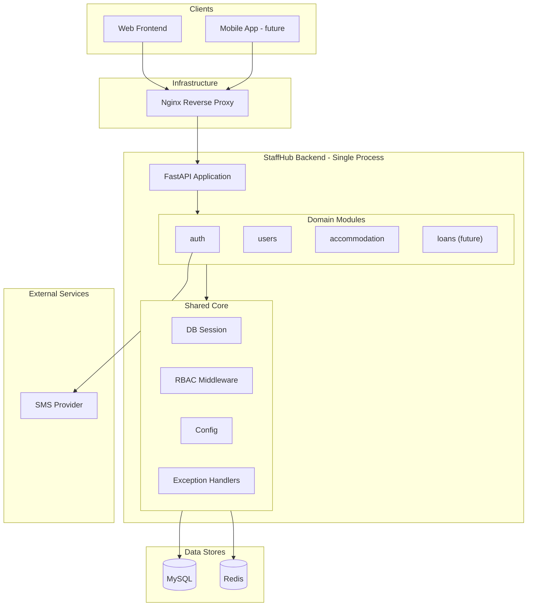
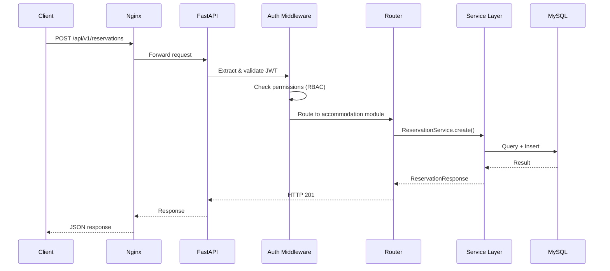
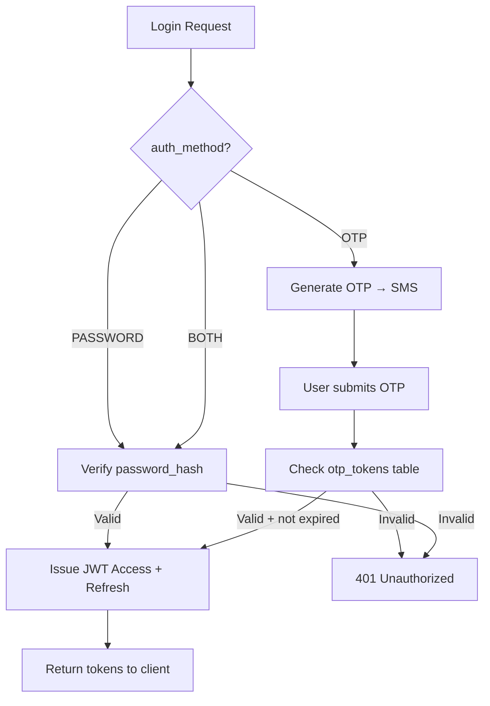
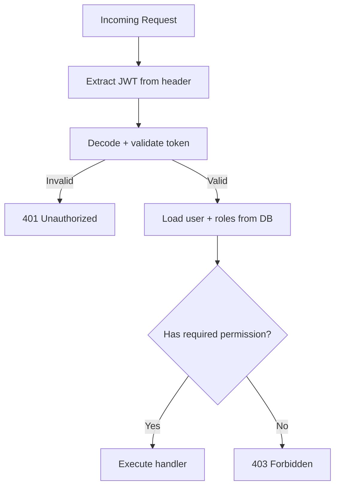

# StaffHub — System Architecture Analysis

> **Version:** 1.0 (Pre-development decision document)  
> **Date:** 2026-02-23  
> **Status:** Approved: Option B — Modular Monolith

---

## Table of Contents

1. [Project Context](#1-project-context)
2. [Architectural Options](#2-architectural-options)
   - [Option A: Monolith](#option-a-monolith-single-deployable)
   - [Option B: Modular Monolith](#option-b-modular-monolith)
   - [Option C: Microservices](#option-c-microservices)
   - [Option D: Modular Monolith with API Gateway](#option-d-modular-monolith--api-gateway)
3. [Comparison Matrix](#3-comparison-matrix)
4. [Recommendation](#4-recommendation)
5. [Recommended Stack](#5-recommended-stack)
6. [High-Level Architecture](#6-high-level-architecture)
7. [Module Breakdown](#7-module-breakdown)
8. [Project Structure](#8-project-structure)
9. [API Design](#9-api-design)
10. [Authentication & Authorization Flow](#10-authentication--authorization-flow)
11. [Background Jobs & Scheduling](#11-background-jobs--scheduling)
12. [Deployment Strategy](#12-deployment-strategy)
13. [Evolution Path](#13-evolution-path)
14. [Decision Log](#14-decision-log)

---

## 1. Project Context

Before evaluating architectures, here are the constraints that shape the decision:

| Factor | Reality |
|--------|---------|
| **Team size** | Small (1–3 developers initially) |
| **Domains in V1** | 2 (Identity/Access + Accommodation) |
| **Domains in V2** | 3 (+ Loans) |
| **Users** | Employees across multiple organizations — internal tool, not public-facing |
| **Traffic** | Low-to-moderate. Not a consumer app. Hundreds, maybe low thousands of users |
| **Integrations** | SMS provider (OTP), potentially banks in V2 |
| **Database** | Single MySQL instance (already designed) |
| **Calendar** | Shamsi (Jalali) — handled at app layer |
| **Deployment target** | Likely a single VPS or small cloud setup initially |
| **Budget** | Startup/internal project — cost-sensitive |

---

## 2. Architectural Options

### Option A: Monolith (Single Deployable)

One codebase, one process, one deployment. All modules (auth, users, accommodation) live in the same application with no internal boundaries enforced.

```
┌──────────────────────────────────┐
│           StaffHub App           │
│  ┌─────┐ ┌──────┐ ┌───────────┐ │
│  │Auth │ │Users │ │Accommod.  │ │
│  └─────┘ └──────┘ └───────────┘ │
│         Shared everything        │
└──────────────┬───────────────────┘
               │
          ┌────┴────┐
          │  MySQL  │
          └─────────┘
```

**Pros**

- Simplest to build — no inter-service communication, no distributed transactions
- Fastest time-to-market for V1
- Single deployment, single log stream, trivial debugging
- No network overhead between modules
- Easy refactoring — just move code within the same process
- One CI/CD pipeline

**Cons**

- Modules can become tightly coupled over time if discipline is weak
- A bug in one module can crash the entire application
- Scaling is all-or-nothing — cannot scale accommodation separately from auth
- As the codebase grows past ~50k lines, navigation and onboarding slow down
- Deployment of a tiny fix requires redeploying the entire application

**Best for:** Solo developers or very small teams building an MVP. Good when you want speed and simplicity above all else.

---

### Option B: Modular Monolith

Still one deployable, but the codebase is explicitly divided into **modules** (Python packages) with clear boundaries. Modules communicate through defined internal interfaces — not by importing each other's internals.

```
┌──────────────────────────────────────────────┐
│              StaffHub App (one process)       │
│                                              │
│  ┌──────────┐  ┌──────────┐  ┌────────────┐ │
│  │  auth    │  │  users   │  │ accommod.  │ │
│  │  module  │  │  module  │  │  module    │ │
│  ├──────────┤  ├──────────┤  ├────────────┤ │
│  │ routes   │  │ routes   │  │ routes     │ │
│  │ services │  │ services │  │ services   │ │
│  │ schemas  │  │ schemas  │  │ schemas    │ │
│  └────┬─────┘  └────┬─────┘  └─────┬──────┘ │
│       │              │              │        │
│  ┌────┴──────────────┴──────────────┴──────┐ │
│  │         Shared Core Layer               │ │
│  │  (db session, RBAC, config, exceptions) │ │
│  └─────────────────────────────────────────┘ │
└──────────────────────┬───────────────────────┘
                       │
                  ┌────┴────┐
                  │  MySQL  │
                  └─────────┘
```

**Pros**

- Same deployment simplicity as a monolith — one process, one deploy
- Enforced module boundaries prevent spaghetti coupling
- Each module has its own routes, services, and schemas — clear ownership
- Adding a new domain (loans) = adding a new module folder, registering its router
- Can be extracted into a microservice later if truly needed — the boundaries are already defined
- Testing is per-module — fast, focused
- Shared infrastructure (DB session, auth middleware, config) avoids duplication

**Cons**

- Slightly more upfront structure to set up compared to a flat monolith
- Requires team discipline to respect module boundaries (though the folder structure helps)
- Still cannot independently scale or deploy individual modules
- A crashing module still brings down the whole app (same as monolith)

**Best for:** Small-to-medium teams building a system with clearly distinct domains and a known path of future expansion. This is the industry standard approach for products that are not yet at the scale where microservices pay off.

---

### Option C: Microservices

Each domain runs as a separate service with its own process, potentially its own database, and services communicate over the network (HTTP/gRPC/message queue).

```
┌──────────┐    ┌──────────┐    ┌─────────────┐
│  Auth    │    │  Users   │    │ Accommod.   │
│ Service  │    │ Service  │    │ Service     │
│ :8001    │    │ :8002    │    │ :8003       │
└────┬─────┘    └────┬─────┘    └──────┬──────┘
     │               │                │
     └───────┬───────┴────────┬───────┘
             │                │
     ┌───────┴──┐     ┌──────┴───┐
     │ MySQL-1  │     │ MySQL-2  │
     └──────────┘     └──────────┘
```

**Pros**

- Independent deployment — can update accommodation without touching auth
- Independent scaling — can run 5 replicas of accommodation, 1 of auth
- Technology diversity — each service can use different languages/frameworks (rarely useful in practice)
- Fault isolation — auth crashing does not kill accommodation (if designed well)
- Clear ownership boundaries in larger teams (10+ developers)

**Cons**

- Massive operational complexity — service discovery, load balancing, distributed tracing, circuit breakers
- Network latency on every cross-service call (auth checks, user lookups)
- Distributed transactions are hard — "reserve room AND update discount usage" across services requires sagas or eventual consistency
- Need API gateway, container orchestration (Kubernetes or similar), centralized logging
- Data duplication or shared-database anti-pattern if not designed carefully
- Testing is harder — integration tests need multiple services running
- Debugging a request that spans 3 services is significantly harder
- For a team of 1–3, the infrastructure overhead will consume more time than feature development
- Overkill for hundreds of users on an internal tool

**Best for:** Large teams (10+) with high-traffic public-facing systems where independent scaling and deployment of individual services is a genuine operational need. Not appropriate for early-stage or internal-tool projects.

---

### Option D: Modular Monolith + API Gateway

A modular monolith as described in Option B, but placed behind a reverse proxy / API gateway (like Nginx, Traefik, or Kong). This separates concerns like SSL termination, rate limiting, and routing without splitting the application itself.

```
┌────────────────┐
│  API Gateway   │  (Nginx / Traefik)
│  - SSL         │
│  - Rate limit  │
│  - Routing     │
└───────┬────────┘
        │
┌───────┴────────────────────────────────────┐
│         StaffHub Modular Monolith          │
│  ┌──────┐  ┌───────┐  ┌────────────────┐  │
│  │ auth │  │ users │  │ accommodation  │  │
│  └──────┘  └───────┘  └────────────────┘  │
└──────────────────┬─────────────────────────┘
                   │
              ┌────┴────┐
              │  MySQL  │
              └─────────┘
```

**Pros**

- All benefits of Option B
- Gateway handles cross-cutting infra (SSL, rate limiting, request logging) outside the app
- Prepares for future split — if accommodation needs its own service someday, the gateway routes are already in place

**Cons**

- Adds an infrastructure component to manage (minor overhead — Nginx is trivial to configure)
- For a single backend on a single server, the gateway may be unnecessary

**Best for:** Any production deployment of Option B. In practice, every real deployment puts a reverse proxy in front of the app anyway, so this is essentially "Option B, deployed properly."

---

## 3. Comparison Matrix

| Criteria | A: Monolith | B: Modular Monolith | C: Microservices | D: Mod. Mono + GW |
|----------|:-----------:|:-------------------:|:----------------:|:------------------:|
| Setup complexity | Very Low | Low | Very High | Low |
| Development speed (V1) | Fast | Fast | Slow | Fast |
| Module isolation | None | Strong | Complete | Strong |
| Operational overhead | Minimal | Minimal | Very High | Low |
| Independent scaling | No | No | Yes | No |
| Independent deployment | No | No | Yes | No |
| Future extractability | Hard | Easy | N/A (already split) | Easy |
| Team size fit (1–3 devs) | Good | Best | Poor | Best |
| Debugging ease | Easy | Easy | Hard | Easy |
| Adding loans (V2) cost | Medium | Low | High | Low |
| Risk of tech debt | High | Low | Low | Low |
| Infrastructure cost | Lowest | Lowest | Highest | Low |

---

## 4. Recommendation

### Go with Option B: Modular Monolith (deploying as Option D in production)

**Rationale:**

1. **Team size vs. complexity.** For 1–3 developers, microservices will slow you down. The operational overhead (service mesh, distributed tracing, inter-service auth, separate CI pipelines) consumes time that should go into features.

2. **The domains are related, not independent.** Accommodation needs user data on every request. Loan will need user profiles and org data. These are not isolated bounded contexts — they share a core identity model. A modular monolith with a shared database is the natural fit.

3. **Scale is not a concern.** An internal tool serving hundreds of users across a few organizations does not need independent horizontal scaling of individual services.

4. **Future-proof without premature complexity.** If StaffHub grows to thousands of organizations and the accommodation module genuinely becomes a bottleneck, extracting it from a well-structured modular monolith into a standalone service is a known, well-practiced migration. But doing it now would be premature.

5. **The database is already shared.** The schema you have designed is a single database with FK relationships across domains. This aligns naturally with a monolith or modular monolith. Microservices with a shared database is an anti-pattern.

> "If you can't build a well-structured monolith, what makes you think you can build a well-structured set of microservices?" — Simon Brown

---

## 5. Recommended Stack

| Layer | Technology | Rationale |
|-------|-----------|-----------|
| **Language** | Python 3.11+ | Already chose SQLAlchemy/Alembic; rich ecosystem for business apps |
| **Framework** | FastAPI | Async support, automatic OpenAPI docs, Pydantic validation, dependency injection |
| **ORM** | SQLAlchemy 2.x | Already in use for DB models; production-grade, well-documented |
| **Migrations** | Alembic | Already in use |
| **Database** | MySQL 8.x | Already chosen |
| **Auth** | JWT (access + refresh tokens) | Stateless, works with both password and OTP flows |
| **Background jobs** | Celery + Redis (or ARQ for lightweight) | Reservation expiry (72h), scheduled tasks |
| **Caching** | Redis | Session blacklist, OTP rate limiting, future: caching |
| **SMS Provider** | Pluggable adapter (Kavenegar / SMS.ir) | Behind an interface — swap provider without changing business logic |
| **API Gateway** | Nginx (production) | SSL, rate limiting, static files, reverse proxy |
| **Testing** | pytest + httpx (async test client) | Per-module test suites |
| **Containerization** | Docker + docker-compose | Consistent dev/prod environments |

---

## 6. High-Level Architecture



### Request Flow



---

## 7. Module Breakdown

### Module: `auth`

Handles authentication only — not user CRUD.

| Responsibility | Details |
|---------------|---------|
| Password login | Verify credentials, issue JWT pair |
| OTP login | Generate OTP, send via SMS, verify |
| Token refresh | Rotate access tokens using refresh tokens |
| Token blacklist | Revoke refresh tokens on logout |
| Rate limiting | Prevent brute-force on login/OTP endpoints |

**Depends on:** `core` (DB session, config)  
**Depended on by:** All modules (via auth middleware)

### Module: `users`

All user and organization management.

| Responsibility | Details |
|---------------|---------|
| Organization CRUD | Create/edit/deactivate orgs |
| User CRUD | Create/edit/deactivate users (admin only) |
| Profile management | Update personal data, children |
| Role assignment | Assign/remove roles (with max-2 check) |
| Bulk import | Director uploads Excel → users created |

**Depends on:** `core`  
**Depended on by:** `accommodation`, `loans` (via service calls within the same process)

### Module: `accommodation`

Reservation and place management.

| Responsibility | Details |
|---------------|---------|
| Place management | CRUD for places, rooms, availability |
| Pricing | Manage pricing rules per place/room/group |
| Reservations | Create, list, cancel reservations |
| Admin review | Approve/reject requests (72h window) |
| Discount logic | Calculate tier-based discounts |
| Special plans | New marriage / new child plan enforcement |
| Conflict resolution | Priority logic when multiple users reserve same room |

**Depends on:** `core`, `users` (to look up user profiles, org access)  
**Depended on by:** None currently

### Module: `loans` (V2 — future)

Will be added as a new module folder. No changes to existing modules needed.

| Responsibility | Details |
|---------------|---------|
| Bank & cap management | Admin configures banks, per-level caps |
| Budget tracking | Per org-manager, per bank |
| Loan requests | Employee applies, goes through approval chain |
| Letter issuance | Manager issues bank letters |
| Outcome tracking | Director marks received/not-received |

**Depends on:** `core`, `users`  
**Depended on by:** None

---

## 8. Project Structure

```
staffhub/
├── architecture/
│   └── SYSTEM_ARCHITECTURE.md      ← this document
├── db/
│   ├── alembic.ini
│   ├── alembic/
│   │   ├── env.py
│   │   ├── script.py.mako
│   │   └── versions/
│   ├── models/
│   │   ├── __init__.py
│   │   ├── base.py
│   │   ├── identity.py
│   │   ├── access.py
│   │   └── accommodation.py
│   └── DATABASE_DESIGN.md
├── src/
│   ├── main.py                     # FastAPI app factory, mount routers
│   ├── config.py                   # Pydantic Settings (env-based config)
│   ├── core/
│   │   ├── __init__.py
│   │   ├── database.py             # Engine, SessionLocal, get_db dependency
│   │   ├── security.py             # JWT encode/decode, password hashing
│   │   ├── permissions.py          # RBAC dependency (require_permission)
│   │   ├── exceptions.py           # App-wide exception classes
│   │   └── pagination.py           # Shared pagination logic
│   ├── modules/
│   │   ├── auth/
│   │   │   ├── __init__.py
│   │   │   ├── router.py           # POST /login, /otp/send, /otp/verify, /refresh
│   │   │   ├── service.py          # AuthService
│   │   │   ├── schemas.py          # Pydantic request/response models
│   │   │   └── dependencies.py     # get_current_user
│   │   ├── users/
│   │   │   ├── __init__.py
│   │   │   ├── router.py           # /organizations, /users, /users/{id}/roles
│   │   │   ├── service.py          # UserService, OrgService
│   │   │   └── schemas.py
│   │   ├── accommodation/
│   │   │   ├── __init__.py
│   │   │   ├── router.py           # /places, /reservations, /pricing
│   │   │   ├── service.py          # ReservationService, PlaceService, PricingService
│   │   │   ├── schemas.py
│   │   │   └── tasks.py            # Celery tasks (expire reservations)
│   │   └── loans/                  # V2 — empty placeholder
│   │       └── __init__.py
│   └── adapters/
│       ├── __init__.py
│       └── sms.py                  # SMSAdapter interface + Kavenegar/SMS.ir impl
├── tests/
│   ├── conftest.py                 # Fixtures: test DB, test client, auth helpers
│   ├── test_auth/
│   ├── test_users/
│   └── test_accommodation/
├── docker-compose.yml              # MySQL + Redis + App
├── Dockerfile
├── requirements.txt
├── .env.example
└── README.md
```

### Key Structural Rules

1. **Modules never import from each other's internals.** If `accommodation` needs user data, it calls `UserService` methods — never imports `users/router.py` or `users/schemas.py` directly.

2. **All cross-cutting concerns live in `core/`.** Database sessions, RBAC checks, JWT logic, exceptions, pagination.

3. **Each module has exactly 4 files:** `router.py` (HTTP layer), `service.py` (business logic), `schemas.py` (Pydantic models), and optionally `tasks.py` (background jobs) or `dependencies.py` (FastAPI dependencies).

4. **DB models stay in `db/models/`.** They are not duplicated inside modules. Modules import models from the `db` package.

---

## 9. API Design

### Versioned API

All endpoints are prefixed with `/api/v1/`. When breaking changes are needed, add `/api/v2/` routes alongside V1.

### Endpoint Map (V1)

**Auth**

| Method | Endpoint | Permission | Description |
|--------|----------|-----------|-------------|
| POST | /auth/login | Public | Password-based login |
| POST | /auth/otp/send | Public | Send OTP to phone |
| POST | /auth/otp/verify | Public | Verify OTP, get tokens |
| POST | /auth/refresh | Public | Refresh access token |
| POST | /auth/logout | Authenticated | Blacklist refresh token |

**Users & Organizations**

| Method | Endpoint | Permission | Description |
|--------|----------|-----------|-------------|
| GET | /organizations | user.view | List organizations |
| POST | /organizations | org.manage | Create organization |
| GET | /users | user.view | List users (scoped by role) |
| POST | /users | user.create | Create user |
| PATCH | /users/{id} | user.edit | Update user profile |
| PUT | /users/{id}/roles | user.assign_role | Assign roles |
| POST | /users/{id}/children | user.edit | Add child record |
| PATCH | /users/{id}/deactivate | user.deactivate | Soft-delete |

**Accommodation**

| Method | Endpoint | Permission | Description |
|--------|----------|-----------|-------------|
| GET | /places | reservation.create | List available places |
| POST | /places | place.manage | Create place |
| PATCH | /places/{id} | place.manage | Update place |
| PUT | /places/{id}/availability | place.set_availability | Block/unblock dates |
| PUT | /places/{id}/org-access | org.set_place_access | Set org access |
| GET | /places/{id}/rooms | reservation.create | List rooms + prices |
| POST | /pricing-rules | pricing.manage | Set pricing |
| POST | /reservations | reservation.create | Create reservation |
| GET | /reservations | reservation.view_own | List own reservations |
| GET | /reservations/all | reservation.view_all | Admin: list all |
| PATCH | /reservations/{id}/review | reservation.approve | Approve/reject |
| PATCH | /reservations/{id}/cancel | reservation.create | Cancel own |
| POST | /reservations/{id}/assign-vip | reservation.assign_vip | Admin: assign VIP |

---

## 10. Authentication & Authorization Flow

### Authentication (Who are you?)



### Authorization (What can you do?)



JWT payload includes `user_id`, `org_id`, and `role_keys`. The RBAC middleware resolves permission keys from role_keys and checks against the required permission for the endpoint.

---

## 11. Background Jobs & Scheduling

| Job | Trigger | Logic |
|-----|---------|-------|
| **Expire pending reservations** | Runs every 15 minutes | Find reservations where `status = PENDING` AND `admin_deadline_at < NOW()`. Apply conflict resolution (fewer past reservations → earlier created_at). Mark winner as APPROVED, losers as EXPIRED. |
| **Clean expired OTPs** | Runs daily | Delete otp_tokens where `expires_at < NOW() - 7 days` |
| **Special plan expiry notifications** | Runs daily | Find `special_plans` where `eligible_until` is within 7 days and `is_used = FALSE`. Queue notification (future module). |

Implementation: Celery Beat (periodic scheduler) with Redis as broker. Lightweight alternative for V1: APScheduler running inside the FastAPI process.

---

## 12. Deployment Strategy

### Development

```
docker-compose up
```

Runs MySQL, Redis, and the FastAPI app with hot-reload. Alembic migrations run automatically on startup (or via a one-time init container).

### Production (Single Server)

```
┌─────────────────────────────────────────┐
│              Linux VPS                  │
│                                         │
│  ┌─────────┐  ┌──────────────────────┐  │
│  │  Nginx  │──│  Gunicorn + Uvicorn  │  │
│  │  :443   │  │  (StaffHub app)      │  │
│  └─────────┘  └──────────┬───────────┘  │
│                          │              │
│  ┌──────────┐    ┌───────┴──┐           │
│  │  Redis   │    │  MySQL   │           │
│  └──────────┘    └──────────┘           │
│                                         │
│  ┌──────────────────────┐               │
│  │  Celery Worker       │               │
│  │  + Celery Beat       │               │
│  └──────────────────────┘               │
└─────────────────────────────────────────┘
```

All components run as Docker containers orchestrated by `docker-compose`. This is sufficient for the expected load and keeps operational costs minimal.

### Scaling Up (if ever needed)

If the system grows to serve many more organizations:

1. **Vertical first.** Move to a larger VPS. This is the simplest and cheapest option.
2. **Separate DB.** Move MySQL to a managed service (RDS, PlanetScale).
3. **Horizontal app.** Run 2–3 app replicas behind a load balancer. Stateless JWT auth means no session affinity needed.
4. **Extract a service.** If one module (e.g., accommodation) becomes a bottleneck with fundamentally different scaling needs, extract it from the modular monolith into a standalone service. The module boundaries are already in place to make this clean.

---

## 13. Evolution Path

This diagram shows the planned growth of the system and how the architecture supports it without rewrites:

```mermaid
graph LR
    subgraph v1 [V1.0 - Current]
        Auth1[auth module]
        Users1[users module]
        Accom1[accommodation module]
    end

    subgraph v2 [V2.0 - Add Loans]
        direction TB
        Loans2["+ loans module"]
        Audit2["+ audit_log (core)"]
        Note2["Just add module folder + migration 004"]
    end

    subgraph v2x [V2.x - Notifications]
        direction TB
        Notif["+ notifications module"]
        Note2x["SMS/email/in-app via adapter pattern"]
    end

    subgraph v3 [V3.0 - If Scale Demands]
        direction TB
        Extract["Extract accommodation into service"]
        Note3["Only if genuinely needed"]
    end

    v1 --> v2
    v2 --> v2x
    v2x -.-> v3
```



### What Adding a New Module Looks Like

When it is time to add the Loans system in V2, the work is:

1. Create `src/modules/loans/` with `router.py`, `service.py`, `schemas.py`
2. Create `db/models/loans.py` with the new tables
3. Create Alembic migration `004_create_loan_tables.py`
4. Seed new permissions: `loan.request`, `loan.approve`, `loan.issue_letter`, etc.
5. Register the loans router in `main.py`

No existing module is modified. No infrastructure changes. No new services to deploy.

---

## 14. Decision Log

| # | Decision | Rationale | Revisit When |
|---|----------|-----------|-------------|
| D1 | Modular monolith over microservices | Small team, shared data, low traffic | Team > 8, or a single module needs 10x the scale of others |
| D2 | FastAPI over Django | Async-native, lighter, auto-OpenAPI, Pydantic-first | Never — this is the right fit for an API-only backend |
| D3 | JWT over session-based auth | Stateless, supports mobile clients, simple RBAC embedding | If real-time WebSocket auth becomes dominant |
| D4 | Single MySQL database | Domains are related (FKs across modules), transactional consistency needed | If one module reaches billions of rows with different access patterns |
| D5 | Celery for background jobs | Reservation expiry is time-critical; need reliable scheduling | If only 1–2 simple jobs → downgrade to APScheduler |
| D6 | Redis for cache + broker | Dual purpose reduces infra; cheap and simple | Not likely to change |
| D7 | Adapter pattern for SMS | SMS providers change; must be swappable | N/A — this is a permanent pattern |
| D8 | API versioning via URL prefix | Simple, explicit, works with any client | N/A |

---

*This document should be reviewed and approved before development begins. Once a decision is made, update the "Status" field at the top from "Under review" to "Approved: Option B" (or whichever is chosen).*
